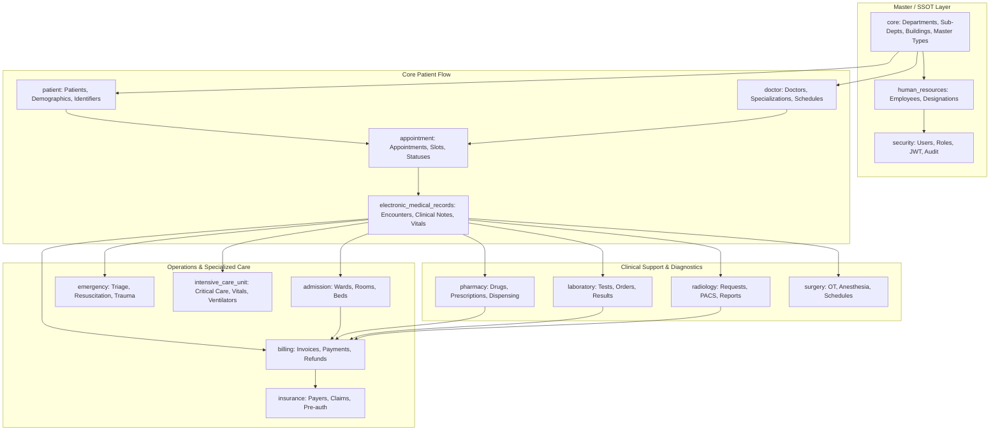
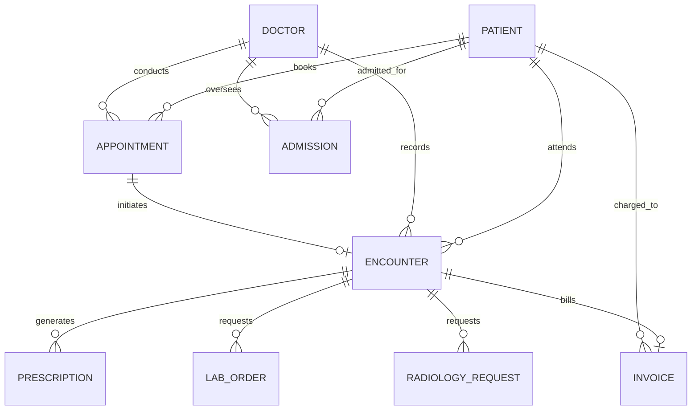

# 🏥 Enterprise Hospital Management System (HMS) — Database Architecture & Schema Documentation

## 1. Architecture Overview

The HMS database is structured across **33 domain schemas** containing **1,053+ tables**, modeled for enterprise scalability, strict relational integrity, and high-performance querying in **PostgreSQL 14+**.

---

## 2. Single Source of Truth (SSOT) & Master Table Architecture

To prevent data fragmentation and keep the system synchronized, all duplicate table definitions across schemas have been resolved to canonical master tables:

| Domain Concept | Canonical Master Schema | Canonical Table | Shared By / Referenced In |
| :--- | :--- | :--- | :--- |
| **Departments** | `core` | `core.departments` | Doctor, HR, Appointments, EMR, Billing, Lab, Radiology |
| **Sub-Departments (Specializations)** | `core` | `core.sub_departments` | Doctor, Surgery, Nursing, Laboratory, Radiology |
| **Employees** | `human_resources` | `human_resources.employees` | Doctor, Nursing, Security Users, Admin, Payroll |
| **Users & Roles** | `security` | `security.users`, `security.roles` | All system authentication and authorization |
| **Patients** | `patient` | `patient.patients` | Appointments, EMR, Billing, Lab, Radiology, Admission |
| **Doctors** | `doctor` | `doctor.doctors` | Appointments, Encounters, Prescriptions, Lab Orders |
| **Document Types** | `core` | `core.master_document_types` | Doctor documents, Patient KYC, Admission paperwork |
| **Insurance Providers** | `insurance` | `insurance.insurance_providers` | Patient insurance policies, Billing claims |
| **Vital Signs & Notes** | `electronic_medical_records` | `electronic_medical_records.vital_signs` | Doctor consultations, Nursing assessments |

---

## 3. Core Relational Interlinking Map

All transactional tables are interlinked using enforced `FOREIGN KEY` constraints:

### Key Foreign Key Rules:
1. **`appointment.appointments`**:
   - `patient_id` $\to$ `patient.patients(patient_id)` (`ON DELETE CASCADE`)
   - `doctor_id` $\to$ `doctor.doctors(doctor_id)` (`ON DELETE RESTRICT`)
   - `department_id` $\to$ `core.departments(department_id)`
2. **`electronic_medical_records.patient_encounters`**:
   - `patient_id` $\to$ `patient.patients(patient_id)` (`ON DELETE CASCADE`)
   - `doctor_id` $\to$ `doctor.doctors(doctor_id)` (`ON DELETE RESTRICT`)
   - `appointment_id` $\to$ `appointment.appointments(appointment_id)` (`ON DELETE SET NULL`)
   - `department_id` $\to$ `core.departments(department_id)`
3. **`billing.invoices`**:
   - `patient_id` $\to$ `patient.patients(patient_id)` (`ON DELETE RESTRICT`)
   - `encounter_id` $\to$ `electronic_medical_records.patient_encounters(encounter_id)`
   - `appointment_id` $\to$ `appointment.appointments(appointment_id)`
4. **`pharmacy.prescriptions`**:
   - `patient_id` $\to$ `patient.patients(patient_id)`
   - `doctor_id` $\to$ `doctor.doctors(doctor_id)`
5. **`laboratory.lab_orders`**:
   - `patient_id` $\to$ `patient.patients(patient_id)`
   - `ordering_doctor_id` $\to$ `doctor.doctors(doctor_id)`
6. **`radiology.radiology_requests`**:
   - `patient_id` $\to$ `patient.patients(patient_id)`
   - `ordering_doctor_id` $\to$ `doctor.doctors(doctor_id)`

---

## 4. PostgreSQL Execution Order (Fresh Database Setup)

To avoid relational dependency errors, run the SQL schema files in the following topological order:

1. `00_PRODUCTION_FUNCTIONS_TRIGGERS.sql`
2. `SHARED_MASTER_TABLES.sql` *(Initializes `core` schema and seed data)*
3. `Security, IAM (Identity & Access Management) & Compliance Management System.sql`
4. `HR & PAYROLL MANAGEMENT SYSTEM.sql`
5. `department.sql`
6. `doctor.sql`
7. `patient.sql`
8. `appointment_management.sql`
9. `QUEUE_MANAGEMENT_SYSTEM.sql`
10. `Electronic_Medical_Records.sql`
11. `PHARMACY_MANAGEMENT_SYSTEM.sql`
12. `Laboratory Information System.sql`
13. `RADIOLOGY INFORMATION SYSTEM.sql`
14. `ADMISSION_&_BED_MANAGEMENT.sql`
15. `EMERGENCY_&_TRAUMA_MANAGEMENT_SYSTEM.sql`
16. `ICU_&_CRITICAL_CARE_MANAGEMENT_SYSTEM.sql`
17. `SURGERY_&_OT_MANAGEMENT_SYSTEM.sql`
18. `NURSING_MANAGEMENT_SYSTEM.sql`
19. `BILLING_&_FINANCIAL_MANAGEMENT.sql`
20. `INSURANCE & CLAIMS MANAGEMENT SYSTEM.sql`
21. `INVENTORY & PROCUREMENT MANAGEMENT SYSTEM.sql`
22. `BLOOD_BANK_MANAGEMENT.sql`
23. `AMBULANCE & TRANSPORT MANAGEMENT SYSTEM.sql`
24. `Category_19_Telemedicine_Virtual_Care.sql`
25. `Category_20_CRM_Patient_Engagement.sql`
26. `DIETETICS_NUTRITION_MANAGEMENT.sql`
27. `HOUSEKEEPING_MANAGEMENT.sql`
28. `BIOMEDICAL_WASTE_MANAGEMENT.sql`
29. `MORTUARY_MEDICOLEGAL_MANAGEMENT.sql`
30. `REHABILITATION_PHYSIOTHERAPY_MANAGEMENT.sql`
31. `VISITOR_MANAGEMENT.sql`
32. `Multi-Hospital  Multi-Tenant Management System.sql`
33. `Analytics & Business Intelligence (BI) Management System.sql`
34. `AI & CLINICAL DECISION SUPPORT SYSTEM.sql`
35. `01_FOREIGN_KEYS_AND_INDEXES.sql` *(Finalizes cross-schema constraints and performance indexes)*

---

## 5. Performance Indexing Strategy

All high-traffic queries and lookup columns are indexed with PostgreSQL B-Tree indexes in `01_FOREIGN_KEYS_AND_INDEXES.sql`:

* **Patient Lookups:** `idx_patients_mrn`, `idx_patients_phone`, `idx_patients_name`, `idx_patients_email`.
* **Doctor Lookups:** `idx_doctors_employee_id`, `idx_doctors_department_id`, `idx_doctors_code`.
* **Appointment Queries:** `idx_appointments_patient_id`, `idx_appointments_doctor_id`, `idx_appointments_date`, `idx_appointments_status`.
* **Clinical Records:** `idx_encounters_patient_id`, `idx_encounters_doctor_id`, `idx_encounters_date`, `idx_vital_signs_encounter`.
* **Financial Queries:** `idx_invoices_patient_id`, `idx_invoices_date`, `idx_invoices_status`, `idx_payments_invoice_id`.
* **Pharmacy & Lab:** `idx_prescriptions_patient_id`, `idx_lab_orders_patient_id`, `idx_radiology_requests_patient_id`.

---

## 6. Schema Catalog & Domain Directory

| Schema Name | Primary Focus | Key Tables |
| :--- | :--- | :--- |
| `core` | Hospital Infrastructure & Master Lookup Tables | `departments`, `sub_departments`, `buildings`, `floors`, `master_document_types` |
| `security` | Authentication, RBAC, Users, Permissions, Audit Logs | `users`, `roles`, `user_roles`, `audit_logs`, `permissions` |
| `human_resources` | Employees, Attendance, Payroll, Leave Management | `employees`, `employee_profiles`, `designations`, `leave_requests`, `payroll` |
| `patient` | Patient Demographics, Identification, Social History | `patients`, `patient_identifiers`, `patient_contacts`, `patient_social_history` |
| `doctor` | Doctor Profiles, Specializations, Schedules, Leaves | `doctors`, `doctor_profiles`, `doctor_schedules`, `doctor_leaves` |
| `appointment` | Appointment Booking, Status Tracking, Time Slots | `appointments`, `appointment_slots`, `appointment_types`, `appointment_statuses` |
| `queue_management` | Real-time OPD & Emergency Token Queue System | `patient_queues`, `queue_tokens`, `calling_stations`, `queue_displays` |
| `electronic_medical_records` | Encounters, Clinical Notes, Diagnosis, Vitals, Allergies | `patient_encounters`, `clinical_notes`, `vital_signs`, `allergies`, `diagnoses` |
| `pharmacy` | Drug Catalog, Prescriptions, Dispensing, Batches | `drugs`, `prescriptions`, `prescription_items`, `dispensing_records`, `batches` |
| `laboratory` | Pathology, Lab Tests, Orders, Specimens, Results | `lab_tests`, `lab_orders`, `lab_specimens`, `lab_results`, `quality_controls` |
| `radiology` | X-Ray, CT, MRI, Ultrasound Requests, PACS, Reports | `radiology_requests`, `radiology_reports`, `imaging_protocols`, `dicom_nodes` |
| `admission` | Inpatient Admissions, Ward, Room & Bed Allocations | `admissions`, `wards`, `rooms`, `beds`, `bed_allocations`, `bed_transfers` |
| `emergency` | Emergency Registration, Triage Levels, Trauma Bays | `emergency_registrations`, `emergency_arrivals`, `trauma_cases`, `code_blue_events` |
| `intensive_care_unit` | ICU Admissions, Continuous Vitals, Ventilator Support | `icu_admissions`, `icu_vitals`, `ventilator_support`, `icu_assessments` |
| `surgery` | Operating Theaters, Surgical Bookings, Anesthesia | `operating_rooms`, `surgery_schedules`, `anesthesia_records`, `post_op_notes` |
| `nursing` | Nurse Shift Handover, Ward Medication Administration | `nurse_shifts`, `nursing_care_plans`, `ward_rounds`, `shift_handovers` |
| `billing` | Invoicing, Line Items, Payments, Receipts, Refunds | `invoices`, `invoice_items`, `payments`, `credit_notes`, `refunds` |
| `insurance` | Payers, Claims, Pre-authorizations, Reimbursements | `insurance_providers`, `patient_insurance_policies`, `insurance_claims`, `remittance` |
| `inventory` | Central Warehouse, Purchase Orders, Goods Receipt | `inventory_items`, `purchase_orders`, `goods_receipts`, `stock_adjustments` |
| `blood_bank` | Donors, Blood Units, Cross-matching, Transfusions | `blood_donors`, `blood_units`, `cross_matches`, `blood_transfusions` |
| `ambulance` | Vehicles, Drivers, Emergency Dispatch, GPS Tracking | `ambulances`, `drivers`, `dispatch_trips`, `trip_locations` |
| `telemedicine` | Virtual Consultations, Video Calls, E-Prescriptions | `virtual_consultations`, `tele_sessions`, `tele_prescriptions` |
| `customer_relationship_management` | Patient Feedback, Complaints, Loyalty, Campaigns | `feedback`, `complaints`, `patient_campaigns`, `reminders` |
| `dietetics` | Inpatient Meal Planning, Nutrition Assessment | `diet_plans`, `meal_schedules`, `nutritional_assessments` |
| `housekeeping` | Room Cleaning Schedules, Sanitation Checklists | `cleaning_schedules`, `room_sanitation_logs`, `laundry_tracking` |
| `biomedical_waste` | Waste Segregation, Color Coded Bags, Disposal Logs | `waste_categories`, `waste_collections`, `disposal_manifests` |
| `mortuary` | Deceased Records, Autopsy Reports, Body Release | `deceased_records`, `autopsy_reports`, `body_releases` |
| `rehabilitation` | Physiotherapy Sessions, Exercises, Progress Tracking | `physio_sessions`, `exercise_plans`, `rehab_assessments` |
| `visitor` | Visitor Passes, Badges, Visiting Hour Tracking | `visitor_passes`, `visitor_logs`, `inmate_visitations` |
| `multi_hospital` | Multi-Tenant Organizations, Branches, Licensing | `tenants`, `hospital_branches`, `tenant_subscriptions` |
| `analytics` | BI Dashboards, Revenue Aggregates, Bed Occupancy | `daily_occupancy_stats`, `revenue_summaries`, `kpi_metrics` |
| `artificial_intelligence` | Clinical Decision Support, Alert Rules, Risk Scoring | `early_warning_scores`, `risk_predictions`, `ai_alert_rules` |
