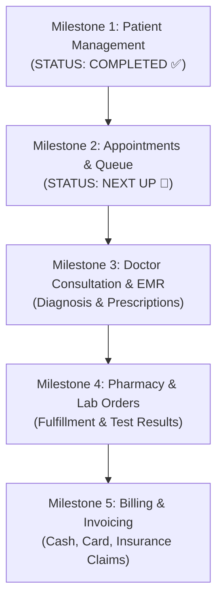

# 🗺️ HMS Development Roadmap & Milestones (Solo Developer)

A practical, phased development roadmap designed for a single developer building a robust, production-ready Hospital Management System without paid subscriptions.

---

## 📅 Milestone Breakdown

### Milestone 1: Core Foundation & Patient Management *(Completed ✅)*
* [x] Audit and normalize all 35 SQL schema files across 33 domains.
* [x] Establish `core.departments` and `core.master_document_types` as Single Source of Truth.
* [x] Create `01_FOREIGN_KEYS_AND_INDEXES.sql` for cross-schema relational integrity.
* [x] Build `Patient` model, Pydantic schemas, and FastAPI endpoints (`/patients`).
* [x] Modularize frontend into `html/`, `css/`, and `js/`.
* [x] Create dedicated **Receptionist Desk Portal (`receptionist.html`)** with live search and MRN generation.

---

### Milestone 2: Appointments & Queue Management *(Next Up 🚀)*
* [ ] **Backend:** Build `Appointment` model in `app/models/appointment.py` mapping `appointment.appointments`.
* [ ] **APIs:**
  * `POST /api/v1/appointments/` — Book appointment for patient with doctor and slot.
  * `GET /api/v1/appointments/doctor/{doctor_id}/today` — Doctor's daily queue.
  * `PUT /api/v1/appointments/{id}/status` — Status updates (`Checked-In`, `In Consultation`, `Completed`).
* [ ] **Frontend:**
  * In `receptionist.html`: Add Appointment Booking Tab (Select Patient + Select Doctor + Pick Time Slot).
  * In `doctor.html`: Add **"Today's Patient Queue"** showing waiting patients.

---

### Milestone 3: Doctor Consultation & EMR
* [ ] **Backend:** Build `PatientEncounter`, `ClinicalNote`, `VitalSign`, and `Prescription` models.
* [ ] **APIs:**
  * `POST /api/v1/consultations/` — Save diagnosis, vitals, and prescription items.
  * `GET /api/v1/patients/{patient_id}/history` — Retrieve past consultation notes and prescription records.
* [ ] **Frontend:**
  * In `doctor.html`: Clinical workspace with Vitals inputs, Diagnosis text editor, and Prescription medicine row adder.

---

### Milestone 4: Pharmacy & Laboratory Management
* [ ] **Pharmacy:** Drug inventory catalog, prescription dispensing queue, batch tracking.
* [ ] **Laboratory:** Lab test catalog, specimen collection logs, and result entry.
* [ ] **Portals:** Build `html/pharmacy.html` and `html/lab.html`.

---

### Milestone 5: Billing, Invoicing & Discharge
* [ ] **Invoicing:** Automatic invoice generation combining consultation fees, prescribed medicines, and lab tests.
* [ ] **Discharge:** Final discharge summary generation and settlement.
